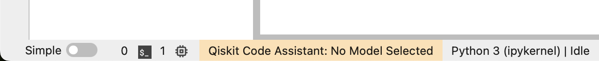
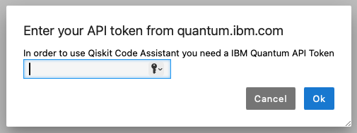
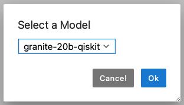
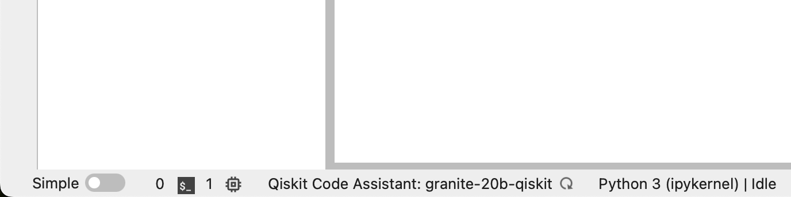

# Gettting Started with the Qiskit Code Assistant

## Requirements

- JupyterLab >= 4.2.0
- An IBM Quantum premium account

## Install

To install the extension, execute:

```bash
pip install qiskit_code_assistant_jupyterlab
```

To install the extension using a GitHub release, download the whl file from the [latest release](https://github.com/Qiskit/qiskit-code-assistant-jupyterlab/releases), then execute:

```bash
pip install PATH/TO/DOWNLOADED/FILE.whl
```

## Uninstall

To remove the extension, execute:

```bash
pip uninstall qiskit_code_assistant_jupyterlab
```

## Using the Qiskit Code Assistant

### IBM Quantum API Token

To make calls to the service API the extension requires an IBM Quantum API token.

#### Getting your API token

Open the [IBM Quantum website](https://quantum.ibm.com/) in your browser and login with
your IBM Quantum account.
After logging in, an API token is displayed on the upper right side of the webpage.


#### Submitting your API token to the extension

When you first open Jupyterlab in a new window or tab you may see that the status bar
is highlighted orange, this shows that the service is not reachable.



If you click the status bar or try to run the completer a dialog will display asking
for your API token, paste the token copied above here.



You can also search for "Qiskit" in the command palette (`Alt Shift C`) to enter or
update your API token.

Once you've submitted a valid API key then the model select dialog will show, you can
open this dialog again to change models by clicking the statusbar.



In addition if the enviroment variable `QISKIT_IBM_TOKEN` is set or the Qiskit
configuration file `~/.qiskit/qiskit-ibm.json` exists then the API token will be
populated at application start. If an API token is entered via the extension it will be
stored in `~/.qiskit/qiskit-ibm.json` under a new config named `qiskit-code-assistant`

### Using the Inline Completer

The inline completer can be triggered using the following key strokes.

- `Alt .` or `Alt \` will run the completer at the current cursor location
- `Alt [` and `Alt ]` can be used to cycle through the list of suggestions if there are
  more than one
- `Alt Tab` or `Alt END` will "accept" the suggested code and insert it at the current
  cursor location

In addition, once the completer runs you can use the buttons on the inline completer
widget to cycle or accept


> NOTE: The service can sometime take a few seconds to retrun a suggestion, you can see
> when the service is working by checking the status bar



### Using the Code Completer

Jupyterlab also includes a traditional completer than displays suggestion in a context
menu rather than inline. This completer can be triggered using `Tab` to run and display
the context menu.

The context menu will include suggestions from the default completer in addition to the
Qiskit Code Assistant suggestions. The context menu also sanitizes and trims the
suggestions, making it less useful for see the code suggestion before inserting it.


### Jupyterlab Settings

There are a few settings we recommend to edit in your user settings.

1. Inline Completer `showWidget` can be set to `always` in order to always show the
   inline completer widget to cycle through and select a completion item

2. Code Completion `providerTimeout` can be increased, our suggested value is `10000` or
   10 seconds. This is 1 second by default and the Qiskit Code Assistant API rarely returns
   within 1 second. This setting only apply the the standard completer that is invoked with
   `Tab`, the inline completer has a default of 10 seconds.

3. If you want to change the instance of the Qiskit Code Assistant Service that the
   extension should use you can edit the Qiskit Code Assistant setting `serviceUrl`

4. Keyboard shortcuts can be changed by searching for `completer` in the Keyboard Shortcuts
   settings and adding new shortcuts for the relevant commands.

## Troubleshooting

If you are seeing the frontend extension, but it is not working, check that the server
extension is enabled:

```bash
jupyter server extension list
```

If the server extension is installed and enabled, but you are not seeing the frontend
extension, check the frontend extension is installed:

```bash
jupyter labextension list
```
